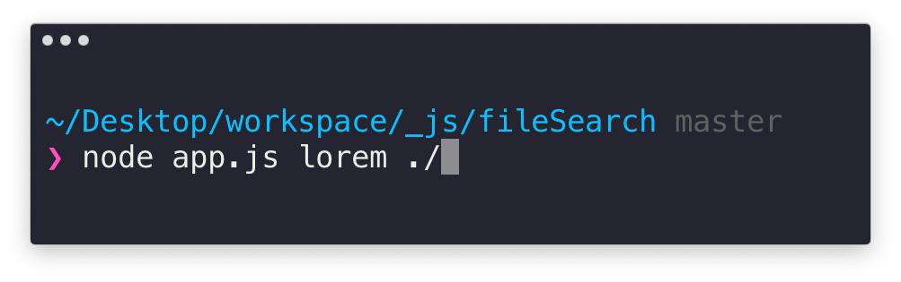
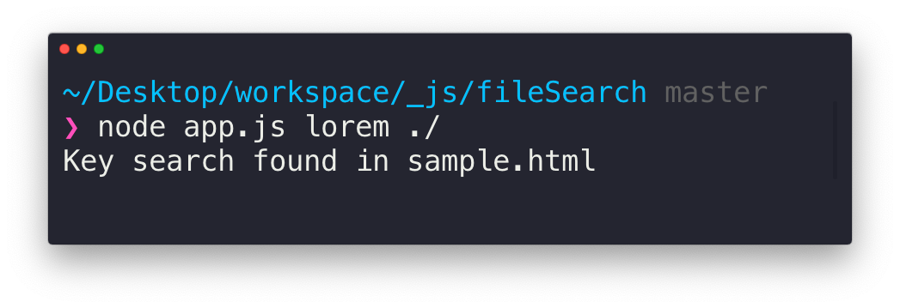

# Search tool

#### What it does?
Search a keyword (a string) in single o multiple files (one level deep)

#### Call with directory as argument...

### ...and return.

### Next step

[-] More level deep
[-] Keep a text file as a keyword
[-] Packanging for NPM and upload